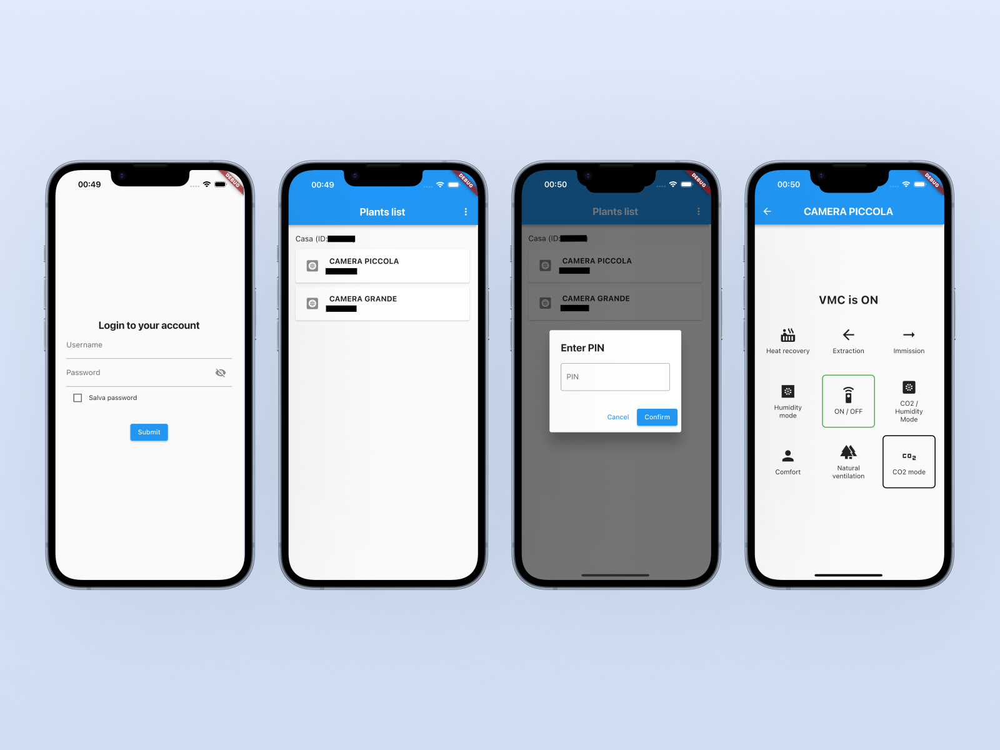

  
   
  <small><em>(Official Tecnosystemi logo not used due to copyright restrictions)</em></small>
    
  <h1>🏠 Open Pico</h1>
  
<em>Multiplatform mobile app to manage your Tecnosystemi Pico devices</em>

Open Pico is a multiplatform mobile app that enables management of Pico devices (manufactured by Tecnosystemi).

This mobile app provides monitoring, control, and automation capabilities for Pico devices, offering an intuitive interface for users.

It took inspiration from:
- The official [Tecnosystemi](https://play.google.com/store/apps/details?id=it.tecnosystemi.TS&hl=it) mobile application

It has been a key point for developing the [Hassio Open Pico](https://github.com/VoidElle/hassio-open-pico/tree/master) Home Assistant integration

## Screenshots 📸

  
   
  <small><em>(IDs has been obscured for privacy reasons)</em></small>

## Limitations ⚠️
- Support only for Pico devices
- Single user support only (APIs support only one valid token at a time)

## Tested On 🧪
- PICO PRO PLUS 30 **(ACD100052)**

*Most features should work on all Pico models*

## Token Architecture 🔐

The most complex aspect of this integration is obtaining and maintaining valid API access tokens. The token mechanism has been **completely reverse-engineered from the official Tecnosystemi mobile application** through extensive analysis of network traffic and binary decompilation.

### Technical Implementation

Unlike conventional stateless bearer tokens, Pico's authentication system employs a sophisticated **stateful token architecture** where the client bears responsibility for token lifecycle management:

- **Token Structure**: Each token encapsulates encrypted payload in the format `{session_identifier}_{call_counter}`
- **Cryptographic Scheme**: AES-256 encryption using CBC mode with PKCS7 padding, base64-encoded output
- **Key Derivation**: Composite key generated from fixed device identifier (first 8 characters) + static salt, hashed with SHA-256 and truncated to 32 bytes
- **Counter Mechanism**: Every API request requires decrypting the token, incrementing the embedded counter, and re-encrypting before transmission

### Security Implications

- **Mutual Exclusion**: Token invalidation occurs upon any successful authentication event (integration login, mobile app login, or direct API access), enforcing single-session semantics
- **Replay Protection**: The incrementing counter prevents replay attacks and ensures request ordering
- **Zero IV**: Uses a null initialization vector (16 zero bytes) for deterministic encryption

This architecture, while unconventional, provides robust session management at the cost of concurrent access limitations. The reverse-engineered implementation maintains full compatibility with the original mobile application's cryptographic protocols.

## Contributing 🤝

Contributions are welcome!

### How to Help
- 🐛 **Report bugs** via [GitHub Issues](https://github.com/VoidElle/hassio-open-pico/issues)
- 🌍 **Translate** to more languages
- 🔧 **Submit PRs** for improvements via [GitHub Pull requests](https://github.com/VoidElle/hassio-open-pico/pulls)
- 📖 **Improve documentation**

### Development
1. Fork and clone the repository
2. Create a feature branch: `git checkout -b feature/name`
3Submit a PR with clear description

## Work in Progress 🚧
- [ ] Proper error handling
- [ ] Execute a login if the API call respond with Unathorized to retrieve a valid token (?)
- [ ] Multi-language support (currently Italian and English only)
